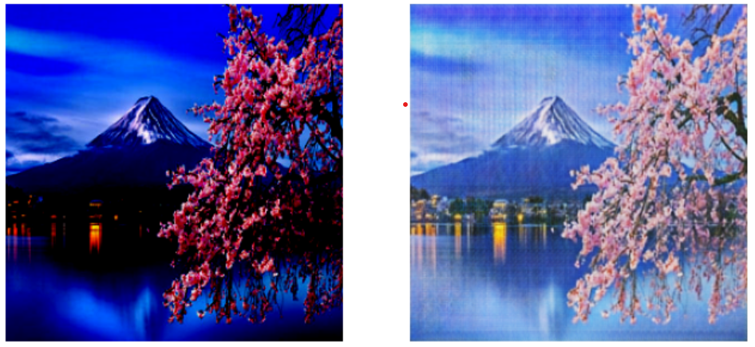

# Transfert de style Monet avec CycleGAN

L’objectif de ce projet est d’utiliser **CycleGAN**, un type de **Generative Adversarial Network (GAN)**, pour convertir des images originales en peintures dans le style de Monet. Ce projet s’inscrit dans la volonté d’explorer les capacités des GANs pour les tâches de **traduction d’images à images**, ainsi que leur potentiel pour générer des œuvres d’art dans différents styles.

Les GANs ont été introduits par Goodfellow et al. en 2014 [1], tandis que les **CycleGANs** ont été proposés par Zhu et al. en 2017 [2] pour permettre la traduction d’images entre deux domaines sans avoir besoin de paires d’images correspondantes.

### Outils et technologies utilisées

* Kaggle 
* Keras
* TensorFlow
* Python
* Deep Learning
* GANs
* Réseaux de neurones convolutifs (CNN)

### Méthodologie

Pour ce projet, nous avons utilisé **TensorFlow** pour entraîner le modèle **CycleGAN** sur le dataset Monet2Photos, comprenant des photographies originales et les peintures correspondantes dans le style de Monet. 

Le modèle CycleGAN est constitué de **deux générateurs** et de **deux discriminateurs**.

* Le premier générateur convertit une image du domaine de la photographie originale vers le domaine de peinture dans le style de Monet.
* Le deuxième générateur effectue la transformation inverse.
* Les discriminateurs distinguent les images réelles des images générées dans leur domaine respectif.

L’entraînement consiste à mettre à jour les générateurs et les discriminateurs de manière **cyclique**, chaque itération comportant une passe avant et arrière à travers les générateurs et discriminateurs. La fonction objectif des générateurs inclut la **perte adversariale** et la **perte de cycle-consistance**, tandis que les discriminateurs utilisent uniquement la perte adversariale.

Le code a été exécuté sur **Kaggle**, qui fournit gratuitement des ressources GPU et TPU. Dans ce projet, nous avons utilisé un **TPU v3-8**, offrant :

* 8 cœurs TPU
* 420 TFlops de performance totale
* Mémoire HBM de 8 Go par cœur
  Ces ressources permettent d’accélérer significativement l’entraînement des modèles de deep learning sur de grands datasets.

### Résultats

Le modèle CycleGAN entraîné a permis de transformer avec succès les photographies originales en peintures dans le style de Monet, produisant des résultats **visuellement agréables et réalistes**. Certaines limites restent : tendance à générer des images légèrement floues, perte de détails fins, ou variations de couleur.

Le projet CycleGAN Monet montre que :

1. CycleGAN peut générer des images réalistes dans le style de Claude Monet, avec des palettes de couleurs et des coups de pinceau similaires.
2. Le transfert de style fonctionne sans besoin de données appariées, ce qui ouvre la voie à de nombreuses applications de traduction d’images.
3. Bien que les résultats soient prometteurs, il reste des améliorations à apporter sur la qualité et la cohérence des images générées.
4. CycleGAN offre un potentiel créatif important pour le **transfert de style artistique** et la création d’œuvres numériques innovantes.

**Références :**
[1] [Generative Adversarial Nets - Goodfellow et al., 2014](https://arxiv.org/abs/1406.2661)
[2] [Unpaired Image-to-Image Translation using CycleGAN - Zhu et al., 2017](https://arxiv.org/abs/1703.10593)

