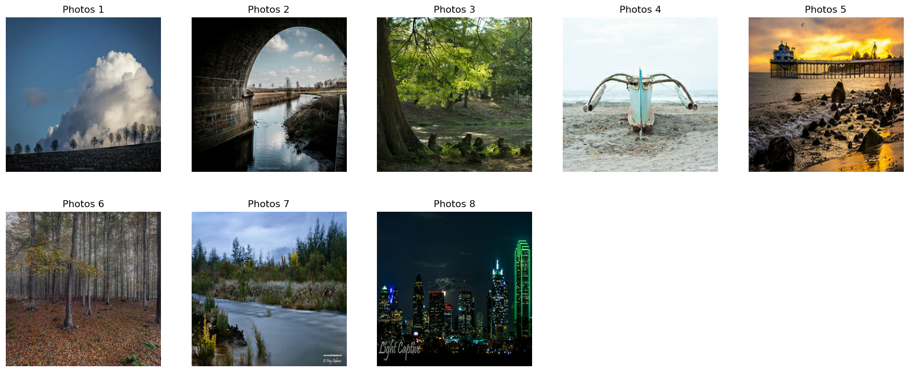
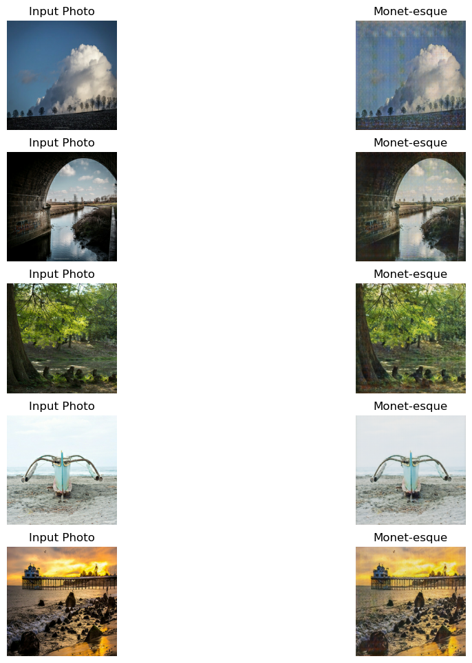
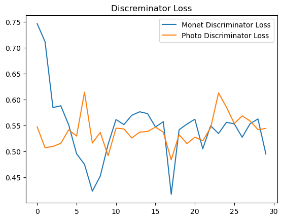

# Monet Style Transfer with CycleGAN

<div align="center">


**Unpaired image-to-image translation — turning landscape photographs into Monet-style impressionist paintings using CycleGAN, trained on Kaggle TPU v3-8.**

</div>

## Overview

Standard image style transfer requires paired training examples — a photograph and its corresponding painting. **CycleGAN** removes this constraint entirely: it learns a bidirectional mapping between two visual domains using only unpaired images, through a cycle-consistency mechanism.

This project trains a CycleGAN to translate between:
- Real landscape photographs → Monet-style impressionist paintings
- Monet paintings → photorealistic images

| Input Photo | Generated Monet-style |
|---|---|
|  |  |

---

## Architecture

CycleGAN consists of **four neural networks** trained simultaneously:

```
Photo Domain (X)                          Monet Domain (Y)
     │                                           │
     ▼                                           ▼
  ┌──────┐  G: X→Y  ┌──────────┐           ┌──────────┐
  │Photo │ ────────►│Generated │           │Real      │
  │  x   │          │Monet G(x)│           │Monet y   │
  └──────┘          └────┬─────┘           └────┬─────┘
     ▲                   │                      │
     │   F: Y→X          ▼                      ▼
     │  ◄──────── Reconstructed x'         Discriminator
     │                                        D_Y
  Cycle Loss:
  ||F(G(x)) - x||₁  +  ||G(F(y)) - y||₁
```

### Generator — U-Net with skip connections

| Stage | Block | Output shape |
|---|---|---|
| Encoder | 8× `downsample` (Conv2D + InstanceNorm + LeakyReLU) | 256→128→64→…→1 |
| Decoder | 6× `upsample` (Conv2DTranspose + InstanceNorm + optional Dropout) | 1→2→…→256 |
| Skip connections | Encoder output concatenated to decoder at each matching level | Preserves fine spatial details |

**InstanceNormalization** (via `tensorflow_addons`) is used instead of BatchNorm — standard for GANs with batch size 1, as it normalises per instance rather than across the batch.

### Discriminator — PatchGAN

Outputs a **30×30 patch map** rather than a single scalar — each cell classifies a local 70×70 pixel patch as real or fake. More parameter-efficient and higher quality than a full-image discriminator.

### Loss Functions

| Loss | Formula | Role |
|---|---|---|
| **Adversarial** | `BinaryCrossentropy(logits=True)` | Generator fools discriminator |
| **Cycle-consistency** | `λ · mean(|F(G(x)) - x|)` with λ=10 | Prevents mode collapse, ensures reconstruction |
| **Identity** | `λ/2 · mean(|G(y) - y|)` | Preserves colour composition |

## Project Structure

```
monet-style-transfer/
├── notebooks/
│   └── cyclegan-monet-training.ipynb    # Full training pipeline
├── src/
│   └── model_notes.md                   # Architecture and training notes
├── images/
│   ├── examples/                        # Training dataset samples
│   │   ├── capture1.jpg
│   │   ├── capture2.jpg
│   │   └── capture3.png
│   └── results/                         # Generated outputs
│       ├── output1.png
│       ├── output2.png
│       ├── outputdl.png
│       └── outputgener.png
├── requirements.txt
├── LICENSE
└── README.md
```

## Training Details

| Parameter | Value |
|---|---|
| Image size | 256 × 256 × 3 |
| Epochs | 50 (30 for initial test) |
| Batch size | 1 |
| Optimizer | Adam (lr=2e-4, β₁=0.5) |
| Cycle-consistency weight (λ) | 10 |
| Hardware | Kaggle TPU v3-8 (8 cores, 420 TFlops) |
| Dataset | Monet2Photo (TFRecord format via Kaggle GCS) |

### Dataset pipeline

Images are loaded directly from Kaggle's GCS buckets as TFRecord files and normalised to `[-1, 1]`:

```python
image = (tf.cast(image, tf.float32) / 127.5) - 1
```

TPU distribution is handled via `tf.distribute.TPUStrategy`, enabling fast parallel training across 8 cores.

## Setup & Usage

### Option A — Kaggle (recommended)

1. Fork `notebooks/cyclegan-monet-training.ipynb` to Kaggle
2. Enable **TPU v3-8** in the notebook settings
3. Add the [Monet2Photo dataset](https://www.kaggle.com/competitions/gan-getting-started/data) as input
4. Run all cells

### Option B — Local

```bash
# Clone the repository
git clone https://github.com/thierno/monet-style-transfer.git
cd monet-style-transfer

# Create a virtual environment
python -m venv venv
source venv/bin/activate        # Linux/macOS
# venv\Scripts\activate         # Windows

# Install dependencies
pip install -r requirements.txt

# Launch the notebook
jupyter notebook notebooks/cyclegan-monet-training.ipynb
```

> Local training is significantly slower without TPU/GPU. For full training runs, Kaggle is strongly recommended.

## Results

The trained CycleGAN successfully transfers photographic scenes into Monet's impressionist style.


*Generator losses decrease steadily over 30 epochs — signs of effective learning.*


*Discriminator losses oscillate around a stable mean — characteristic of GAN equilibrium.*

**Qualitative observations:**
- Monet's warm colour palette and soft brushwork reproduced
- No paired training data required
- Fine details (edges, thin structures) can become slightly blurred
- Some colour inconsistencies on complex textures

## Roadmap

- [ ] Experiment with attention-based CycleGAN for sharper detail preservation
- [ ] Extend to other artistic styles (Van Gogh, Cézanne, Ukiyo-e)
- [ ] Add a Gradio/Streamlit demo for interactive inference on custom photos
- [ ] Export trained generator as a TensorFlow SavedModel

## References

[1] Goodfellow, I. et al. — *Generative Adversarial Nets* (NeurIPS 2014) · [arXiv:1406.2661](https://arxiv.org/abs/1406.2661)

[2] Zhu, J.-Y. et al. — *Unpaired Image-to-Image Translation using Cycle-Consistent Adversarial Networks* (ICCV 2017) · [arXiv:1703.10593](https://arxiv.org/abs/1703.10593)

## License

MIT License — see [LICENSE](LICENSE) for details.
