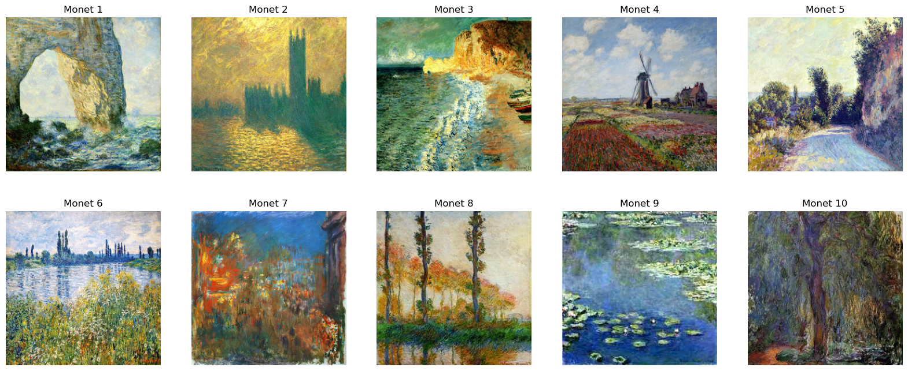

# Monet Style Transfer with CycleGAN

Deep learning project implementing **CycleGAN** to transform landscape photographs into paintings inspired by Claude Monet.

This project explores **unpaired image-to-image translation** using Generative Adversarial Networks.

---

# Project Overview

Generative Adversarial Networks (GANs) enable the generation of realistic data by training two competing neural networks.

This project uses **CycleGAN** to learn a mapping between two visual domains:

- Real photographs
- Monet-style paintings

Unlike traditional supervised methods, CycleGAN does **not require paired images**, making it suitable for artistic style transfer tasks.

---

# Tech Stack

- Python
- TensorFlow
- Keras
- Deep Learning
- Convolutional Neural Networks
- GANs
- Kaggle TPU

---

# Model Architecture

CycleGAN consists of:

- 2 Generators
- 2 Discriminators

Generators learn:

Photo → Monet  
Monet → Photo

Training includes:

- Adversarial Loss
- Cycle Consistency Loss
- Identity Loss

---

# Dataset

The model was trained on the **Monet2Photo dataset**, commonly used for image translation tasks.

The dataset contains:

- Landscape photographs
- Monet paintings

---

# Results

Example outputs of the trained model:



The model successfully generates images with:

- Impressionist color palettes
- Monet-like textures
- Painterly brush strokes

However, some limitations remain:

- Slight blurriness
- Loss of fine details

---

# How to Run

1. Install dependencies

```bash
pip install -r requirements.txt
```
---

2. Open the notebook

notebooks/cyclegan_monet_training.ipynb

---

3. Train or generate images.

# Key Learning Outcomes

- Understanding Generative Adversarial Networks

- Implementing CycleGAN architectures

- Training models using TPU acceleration

- Applying deep learning to artistic style transfer

---

# License

This project is licensed under the MIT License.

---

# References

Goodfellow et al. – Generative Adversarial Nets (2014)

Zhu et al. – Unpaired Image-to-Image Translation using CycleGAN (2017)